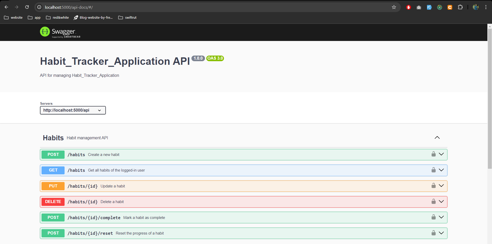
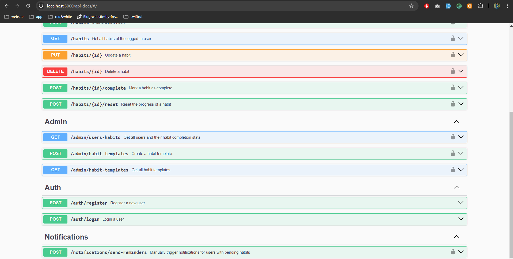

# Habit Tracker Application

  ## Expense Swagger UI
   
   
     
   

A web application that helps users track their habits, view their progress, and receive reminders. Admin users can manage users, view their habit completion stats, and create habit templates for users to adopt.

## Table of Contents

- [Features](#features)
- [Technologies Used](#technologies-used)
- [Installation](#installation)
- [Usage](#usage)
- [API Endpoints](#api-endpoints)
- [License](#license)
- [Contributing](#contributing)

## Features

- **User Authentication**: Secure login and registration with JWT-based authentication.
- **Habit Management**: Create, update, delete, and view habits.
- **Habit Tracking**: Store habit data with streaks, daily progress, and frequency settings.
- **Reminders & Notifications**: Daily reminders for pending habits.
- **Admin Controls**:
  - View all users and their habit completion stats.
  - Create and manage habit templates.

## Technologies Used

- Node.js
- Express.js
- MongoDB
- Mongoose
- JWT for authentication
- Postman for API testing

## Installation

1. Clone the repository:
   git clone https://github.com/yourusername/habit-tracker-app.git

2. Live URL= 
